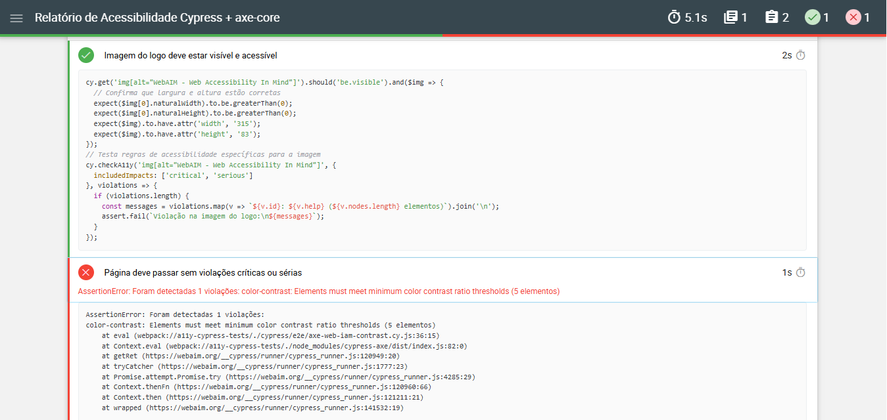

# Testes de Acessibilidade com Cypress e axe-core


> Repositório com testes automatizados de acessibilidade usando Cypress e axe-core (via cypress-axe), para garantir conformidade com boas práticas como as diretrizes WCAG e promover uma experiência inclusiva para todas as pessoas.
---
### ✅ Recursos
- Integração do cypress-axe para análise automatizada de acessibilidade
- Testes baseados em fluxos reais de navegação
- Geração de relatórios claros e acionáveis
- Fácil integração em pipelines de CI/CD
---
## 📁 Estrutura do Projeto
```api-playwright-tests/
├── cypress/e2e            # Casos de testes automatizados
├── cypress/support        # Arquivos de configuração, comandos customizados e helpers
├── scripts/               # script para a funçâo de merge reports
├── .github/workflows/     # Workflows do GitHub Actions
├── cypress.config.ts      # Configuração do Cypress
├── package.json           # Arquivo de configuração do projeto
├── package-lock.json      # Dependências 
└── README.md              # Documentação
```
---
## Pré-requisitos
- Node.js (versão 14+)
- npm ou yarn
- VS Code ou outro editor
- Navegador (Chrome ou Firefox)
---
## 🚀 Tecnologias e ferramentas

- [Cypress](https://www.cypress.io/)
- [axe-core](https://github.com/dequelabs/axe-core)
- [Mochawesome](https://github.com/adamgruber/mochawesome) para relatórios
- Node.js
- GitHub Actions para CI
---
## 📋 Testes incluídos

- Verificação de contraste de cores
- Validação de textos alternativos em imagens
- Navegabilidade via teclado (tabindex)
- Estrutura correta de landmarks e atributos ARIA
- Outros critérios baseados nas diretrizes WCAG 2.1 AA

Site testado:

- [WebAIM Contrast Checker](https://webaim.org/resources/contrastchecker/)

---

## 📦 Instalação

1. Clone este repositório:
```bash
git clone https://github.com/ciboto/a11y-cypress-tests.git
cd a11y-cypress-tests
```
2. Instale dependências:
```bash
npm install
```

## ⚙️ Executando os testes
### Modo headless (CLI)
Roda todos os testes em modo headless (sem interface gráfica), ideal para integração contínua:
```bash
npm run test
```

### Modo UI (interativo)
Para abrir o Cypress Test Runner com interface gráfica e executar testes passo a passo:
```bash
npx cypress open
```
---

## 🧪 Relatórios
Os relatórios dos testes são gerados automaticamente na pasta:
- JSON: `cypress/reports/json`
- HTML: `cypress/reports/html`
Você pode abrir o relatório HTML para visualizar os resultados detalhados dos testes de acessibilidade.

---
## 🚀 Integração Contínua (CI/CD)
Este projeto possui um workflow configurado no GitHub Actions para rodar os testes de acessibilidade automaticamente em pull requests ou manualmente via workflow dispatch.

### Como funciona:

- O workflow é disparado automaticamente em Pull Requests.
- Você também pode rodá-lo manualmente pelo GitHub na aba **Actions** usando o botão **Run workflow**.

### Exemplo de uso

```yaml
name: Cypress Accessibility Tests

on:
  pull_request:
  workflow_dispatch:

jobs:
  cypress-test-accessibility:
    runs-on: ubuntu-latest
    env:
      TERM: xterm-256color

    steps:
      - name: Checkout do código
        uses: actions/checkout@v4

      - name: Setup Node.js
        uses: actions/setup-node@v4
        with:
          node-version: 20

      - name: Instalar dependências
        run: npm ci

      - name: Executar testes Cypress
        run: npm run test || true

      - name: Gerar relatório HTML acessível
        run: npm run report

      - name: Upload do relatório HTML
        uses: actions/upload-artifact@v4
        with:
          name: a11y-html-report
          path: cypress/reports/html/report-test-accessibility-index.html
```
---
## ⚖️ Licença
Este projeto está licenciado sob a [CC BY-NC-ND 4.0](https://creativecommons.org/licenses/by-nc-nd/4.0/) - Consulte o arquivo [LICENSE](./LICENSE) para mais detalhes.
